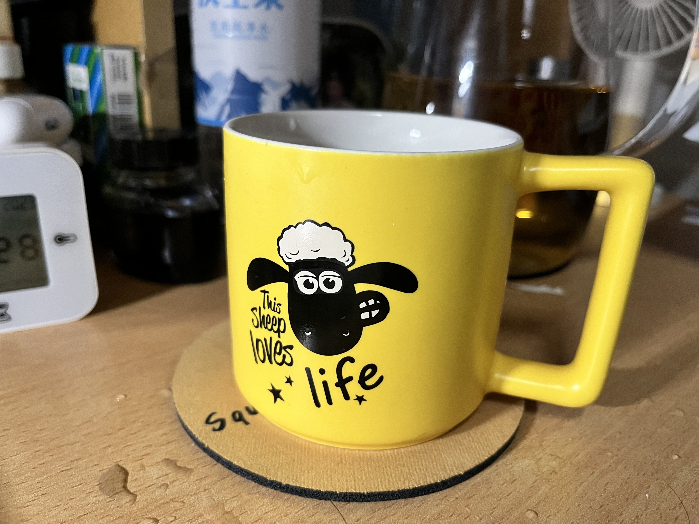

# 赛里布斯的第12周的总结

Author: Salianbooth

Data: 2023/11/18

brief: 本周部分学习内容

## The Study of Markdown 

1. Visual Code
   1. some plug-in 
      1. CMake
      2. CMake Tools
      3. Markdown All in one
      4. Markdown preview Enhanced
      5. Paste Image
   
2. Learned the use of markdown briefly
   1. the title ------  #
   2. highlight ------ ** xx **
   3. Italic --------- *  *  ues one " * "
   4. add picture ----- // ! and [ ] and ()
   

## The study of yolov-5

1. own data stes and train weight file and detect
   1. the first is Pikachu, but the trained out of the weight file isn't very good
   
   2. the second is my mug,  I thought it might be simple to detect ,but due to my computer which did't have Gpu ,I only trained 8 pictures and each of them only trained 4 times ,so it is not very accurate
   

### Brief sum-up
This week is pretty busy because of the six consecutive morning classes , and so many trifles to do .But I'm still happy to learn this knowledge.
   
   
